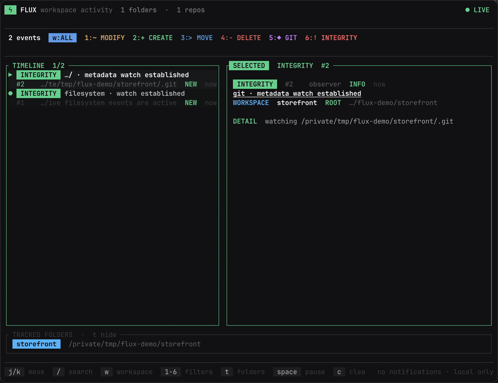

# Flux Capacitor

**Watch coding agents change your projects in real time.**

A native terminal timeline for filesystem and Git activity. No agent wrappers, polling, or vendor integration.



## Install

### Homebrew

```sh
brew install juanandresgs/tap/flux
```

### macOS and Linux

```sh
curl --proto '=https' --tlsv1.2 -LsSf https://github.com/juanandresgs/FluxCapacitor/releases/latest/download/flux-capacitor-installer.sh | sh
```

### Windows PowerShell

```powershell
powershell -ExecutionPolicy Bypass -c "irm https://github.com/juanandresgs/FluxCapacitor/releases/latest/download/flux-capacitor-installer.ps1 | iex"
```

You can also install from source with `cargo install --git https://github.com/juanandresgs/FluxCapacitor`.

## Run

```sh
flux ~/Code/project
flux ~/Code/api ~/Code/web ~/Code/worker
```

## What You See

- File creation, modification, movement, deletion, and contextual diffs.
- Commits, merges, checkouts, branches, tags, stashes, and rewrites.
- Stable workspace labels across multiple projects and concurrent agents.
- Linked Git worktrees joining the timeline automatically.
- Watcher failures and dropped-event signals reported explicitly.

Flux consumes native filesystem notifications. It does not wrap agents, poll repositories, or guess which process caused a change.

## Controls

| Key | Action |
| --- | --- |
| `/` | Filter events |
| `w` / `W` | Cycle workspace focus |
| `t` | Toggle tracked folders |
| `space` | Pause or resume |
| `q` | Quit |

## Status

Flux is an alpha. macOS is the primary tested platform; Linux and Windows are continuously tested but need more field use.

[Implementation details](docs/IMPLEMENTATION_STATUS.md) · [Production readiness](docs/PRODUCTION_READINESS.md) · [Download the demo MP4](assets/demo.mp4)

MIT licensed.
